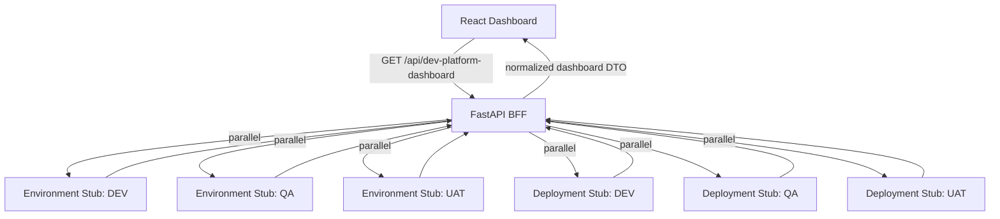

# Developer Platform Demo Architecture

## Boundary

- React owns rendering, routing, loading state, and error state.
- React does not contain sample platform data.
- FastAPI owns dummy endpoint responses and dashboard aggregation.
- The endpoint contracts can later be backed by real environment and deployment microservices.
