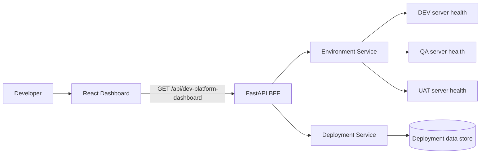

# Developer Platform Demo Architecture

## Demo boundary

The current implementation uses a stubbed service in the React application. The BFF and downstream microservices are represented by contracts so that the UI can be developed without waiting for infrastructure integrations.

## Recommended production flow

1. React calls a single dashboard BFF endpoint.
2. The BFF calls environment and deployment services in parallel.
3. The BFF normalizes partial failures and returns one dashboard-oriented contract.
4. React renders values directly; presentation-only derivations use `useMemo`.
5. Child components remain stateless and do not repeat API calls.
